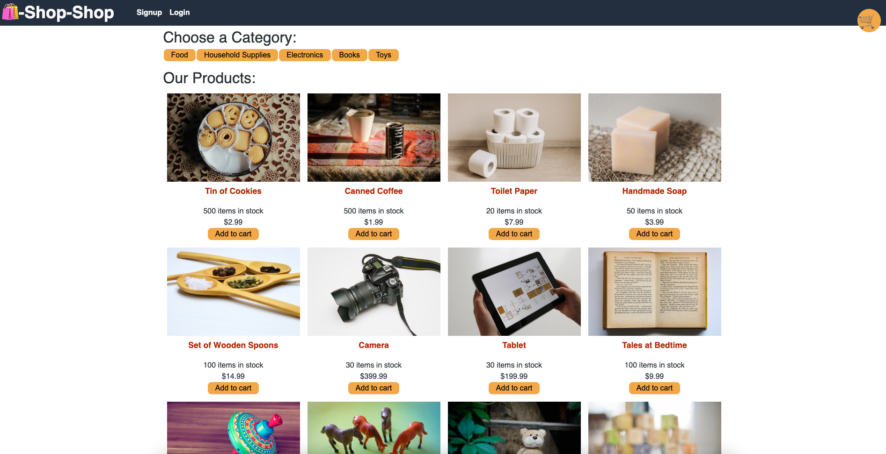

# Shop-Shop

This is a E-commerce application built with MERN stack. A platform for all the shop owners to sell their products and services online.

## Technologies Used

- [MongoDB](https://www.mongodb.com/)
- [Express](https://expressjs.com/)
- [React](https://reactjs.org/)
- [Node.js](https://nodejs.org/)
- [MERN Stack](https://mern.io/)
- [Redux](https://redux.js.org/)
- [Stripe](https://stripe.com/)

## Table of Contents
- [Shop-Shop](#shop-shop)
  - [Technologies Used](#technologies-used)
  - [Table of Contents](#table-of-contents)
  - [Screenshots](#screenshots)
  - [Installation](#installation)
  - [Running the application](#running-the-application)
  - [Deployment](#deployment)
  - [Questions](#questions)

## Screenshots



## Installation

```
git clone git@github.com:jimenezraul/shop-shop.git
cd shop-shop
npm install
```

## Running the application

```
npm run develop
```

## Deployment

- [Live Demo](https://stark-wave-23569.herokuapp.com/)

## Questions

If you have any questions, please feel free to contact me at [jimenezraul1981@gmail.com](mailto:jimenezraul1981@gmail.com)